## BM25 Passage Ranking Baseline, [link]( us)


Passage ranking msmarco datasets, [link](https://microsoft.github.io/msmarco/TREC-Deep-Learning-2019#deep-learning-track-tasks)


| Description  | Filename                                                                                                                            | File size | Num records | Format                   |
|--------------|-------------------------------------------------------------------------------------------------------------------------------------|-----------|-------------|--------------------------|
| Collection   | `collection.tsv`: [collection.tar.gz](https://msmarco.blob.core.windows.net/msmarcoranking/collection.tar.gz)                       | 2.9 GB    | 8,841,823   | tsv: pid, passage        |
| Test queries | `queries.tsv`: [msmarco-test2019-queries.tsv](https://msmarco.blob.core.windows.net/msmarcoranking/msmarco-test2019-queries.tsv.gz) | 12K       | 200         | tsv: qid, query          |
| Test qrels   | `qrels.tsv`: [2019qrels-pass.txt](https://trec.nist.gov/data/deep/2019qrels-pass.txt)                                               | 182K      | 9,260       | qid, "Q0", docid, rating |

**Q: We are not sure if we have the correct qrels?**
**The test queries file contains 200 queriwith es, while the qrels only contain 43 unique query IDs.**
**We can't evaluate queries we have no qrels for, right?**
**A: Datasets are correct. If no relevant documents were found for a query, then it is removed from the qrels.**

### Step 1: Convert collection.tsv to Ansirini jsonl
```
python3 tools/scripts/msmarco/convert_collection_to_jsonl.py \
 --collection-path collections/msmarco-passage/collection.tsv \
 --output-folder collections/msmarco-passage/collection_jsonl
 ```

### Step 2: Index the collection
```
sh target/appassembler/bin/IndexCollection -threads 9 -collection JsonCollection \
 -generator DefaultLuceneDocumentGenerator -input collections/msmarco-passage/collection_jsonl \
 -index indexes/msmarco-passage/lucene-index-msmarco -storePositions -storeDocvectors -storeRaw 
```
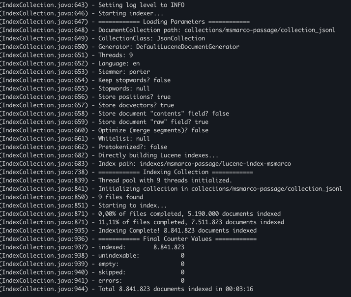

### Step 3: Filter out queries with no qrels
```
python3 tools/scripts/msmarco/filter_queries.py \
--qrels collections/msmarco-passage/qrels.tsv \
--queries collections/msmarco-passage/queries.tsv \
--output collections/msmarco-passage/queries-with-qrels.tsv
```
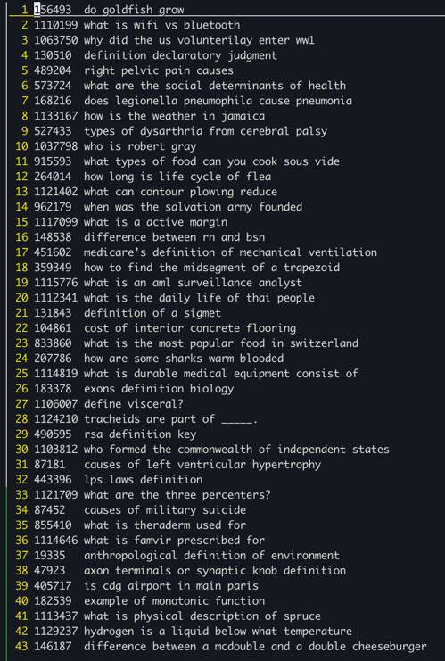

### Step 4: Run BM25 with default values
```
sh target/appassembler/bin/SearchCollection -hits 1000 -parallelism 8 \
 -index indexes/msmarco-passage/lucene-index-msmarco \
 -topicreader TsvInt -topics collections/msmarco-passage/queries-with-qrels.tsv \
 -output runs/run.msmarco-passage.test.tsv -format msmarco \
 -bm25
```
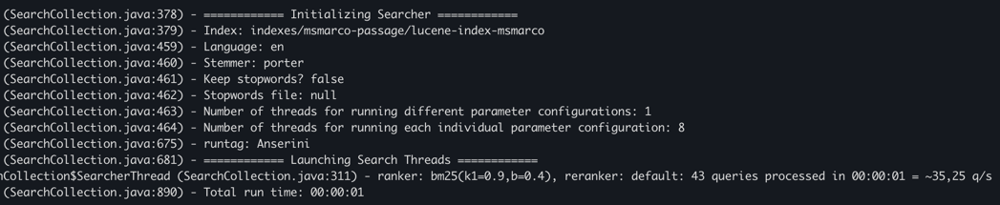


### Step 5A: Evaluate the run (retrieved documents) using MS MARCO evaluation script
```
python3 tools/scripts/msmarco/msmarco_passage_eval.py \
collections/msmarco-passage/qrels.tsv runs/run.msmarco-passage.test.tsv
```
**Q: MRR @10 = 1.0?**
**Isn't this suspicious? For every query, a relevant passage is ranked #1? I'm guessing there are too few queries for a good evaluation of MRR?**
**A: yes. Trec_eval results look okay, but MS_MARCO MRR looks wrong. MS-MARCO probably expects different format.**

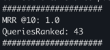

### Step 5B: Evaluate the run using `trec_eval`
```
python3 tools/scripts/msmarco/convert_msmarco_to_trec_run.py \
--input runs/run.msmarco-passage.test.tsv \
--output runs/run.msmarco-passage.test.trec

python3 tools/scripts/msmarco/convert_msmarco_to_trec_qrels.py \
--input collections/msmarco-passage/qrels.tsv \
--output collections/msmarco-passage/qrels.test.trec

tools/eval/trec_eval.9.0.4/trec_eval -c -mrecall.1000 -mmap \
 collections/msmarco-passage/qrels.test.trec runs/run.msmarco-passage.test.trec
```
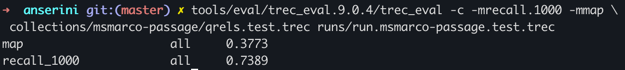

```
tools/eval/trec_eval.9.0.4/trec_eval -c -m official \
collections/msmarco-passage/qrels.test.trec runs/run.msmarco-passage.test.trec
```
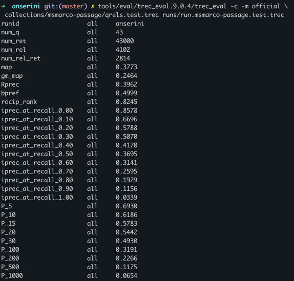

The command below will output all the calculated evaluation metrics c
```
tools/eval/trec_eval.9.0.4/trec_eval -c -m all_trec \
collections/msmarco-passage/qrels.test.trec runs/run.msmarco-passage.test.trec
```


### Metrics
Main metric used in the TREC2019 overview paper: 
* Normalized Discounted Cumulative Gain (NDCG @10)
* Also: NCG @1000 to compare fullrank with rerank - is this relevant for us?
  * "It is a natural compliment to the main metric, NDCG"
  * Not supported by `trec_eval` but correlates strongly wth recall @1000

In short, metrics used seem to be: 
* Normalized Discounted Cumulative Gain (NDCG @10), 
* Reciprocal Rank (RR), 
* Normalized Cumulative Gain (NCG @1000) 
  * not supported in trec_eval, but recall@1000 is strongly correlated [source: TREC2019 overview paper]
* Average Precision (AP)
  * I can't find an Average Precision, but I can find Geometric Mean Average Precision? And Mean Average Precision

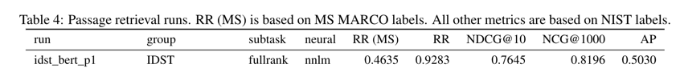

Look at this [link](http://www.rafaelglater.com/en/post/learn-how-to-use-trec_eval-to-evaluate-your-information-retrieval-system)
for an explanation of each metric used in `trec_eval`

Also look at this [link](https://medium.com/@naman.madan25/how-to-use-trec-eval-b59c0ef8cbf9) for trec_eval usage:
* standard usage will give evaluation over entire system,
* -q flag will evaluate topic-wise **which I think is what we need**


```
tools/eval/trec_eval.9.0.4/trec_eval -c -m ndcg_cut.10 -m recip_rank -m recall.1000 -m map \
collections/msmarco-passage/qrels.test.trec runs/run.msmarco-passage.testrm3.trec
```

Run BM25+RM3:
```
sh target/appassembler/bin/SearchCollection -hits 1000 -parallelism 8 \
-index indexes/msmarco-passage/lucene-index-msmarco \
-topicreader TsvInt -topics collections/msmarco-passage/queries-with-qrels.tsv \
-output runs/run.msmarco-passage.testrm3.tsv -format msmarco \
-bm25 -rm3 -rm.outputQuery
```

RM3 salvation army
0.0561
0.0227
0.0000
1.0000


## LTR Pyserini
python3 scripts/ltr_msmarco/convert_queries.py \
--input collections/msmarco-passage/queries.eval.small.tsv \
--output collections/msmarco-ltr-passage/queries.eval.small.json 

python3 scripts/ltr_msmarco/convert_queries.py \
--input collections/msmarco-passage/queries.dev.small.tsv \
--output collections/msmarco-ltr-passage/queries.dev.small.json

python3 scripts/ltr_msmarco/convert_queries.py \
--input collections/msmarco-passage/queries.train.tsv \
--output collections/msmarco-ltr-passage/queries.train.json


python3 -m pyserini.search.lucene.ltr \
--input runs/run.msmarco-passage.testbm25.tsv \
--input-format tsv \
--model runs/msmarco-passage-ltr-mrr-v1 \
--index msmarco-passage-ltr \
--data passage \
--ibm-model collections/msmarco-ltr-passage/ibm_model/ \
--queries collections/msmarco-ltr-passage \
--output runs/run.ltr.msmarco-passage.tsv 


### Pyterrier
using random forest regression - pointwise LTR

#### BASELINE VALUES:
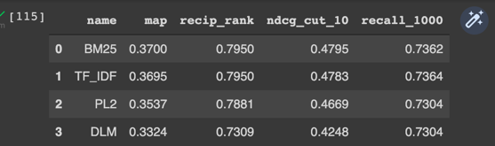

#### RUN 1:
pipeline = bm25 >> (tf_idf ** bm25). tree n = 100. Train queries = 200
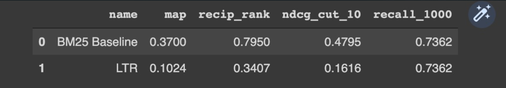

#### RUN 2:
pipeline = bm25 >> (tf_idf ** bm25). tree n = 400. Train queries = 200
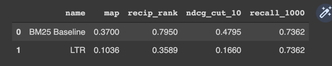

#### RUN 3:
pipeline = bm25 >> (tf_idf ** bm25). tree n = 400. Train queries = 500
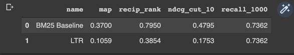

#### RUN 4:
pipeline = bm25 >> (tf_idf ** bm25 ** pl2). tree n = 400. Train queries = 500

time to train          = 15m

time to query (rerank) = 2m 14s

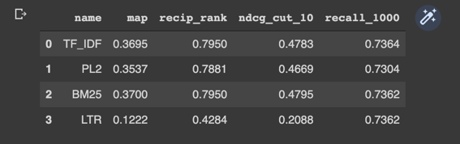

#### RUN 5:
pipeline = bm25 >> (tf_idf ** bm25 ** pl2 ** dlm). tree n = 400. Train queries = 500

time to train          = 20m

time to query (rerank) = 2m 33s

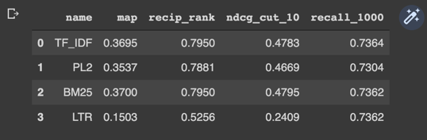

#### RUN 6:
pipeline = bm25 >> (tf_idf ** bm25 ** pl2 ** dlm). tree n = 100. Train queries = 500

time to train          = 8m 28s

time to query (rerank) = 1m 33s

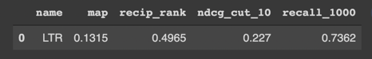

#### RUN 7:
pipeline = bm25 >> (tf_idf ** bm25 ** pl2 ** dlm). tree n = 100. Train queries = 1000

time to train          = 20m 6s

time to query (rerank) = 1m 33s

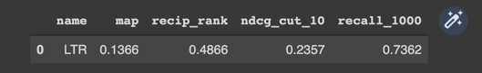

#### RUN 8:
pipeline = bm25 >> (tf_idf ** bm25 ** pl2 ** dlm). tree n = 400. Train queries = 1000

time to train          = 48m

time to query (rerank) = 1m 37s

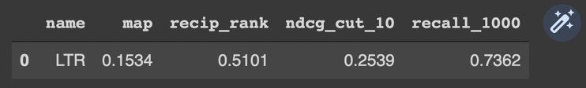

#### RUN 9:
pipeline = bm25 >> (tf_idf ** bm25 ** pl2 ** dlm). tree n = 800. Train queries = 200

time to train          = 11m

time to query (rerank) = 1m 39s

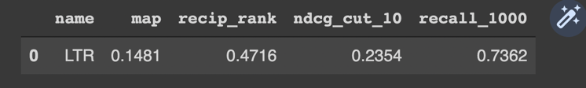

#### RUN 10:
pipeline = bm25 >> (tf_idf ** pl2 ** dlm). tree n = 400. Train queries = 200

train_queries_small, train_qrels_small, valid_queries, valid_qrels

time to train          = ...

time to query (rerank) = ...


